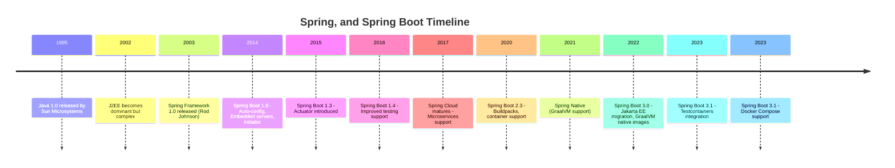
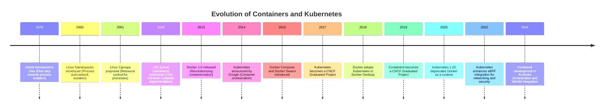
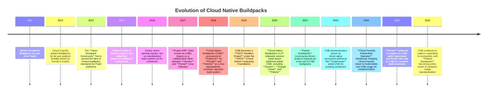

# spring-boot-and-container
Code and stuff for the conference talk

# timeline test

```mermaid

timeline
    title Spring, and Spring Boot Timeline

    1995 : Java 1.0 released by Sun Microsystems
    2002 : J2EE becomes dominant but complex
    2003 : Spring Framework 1.0 released (Rod Johnson)
    2014 : Spring Boot 1.0 - Auto-config, Embedded servers, Initializr
    2015 : Spring Boot 1.3 - Actuator introduced
    2016 : Spring Boot 1.4 - Improved testing support
    2017 : Spring Cloud matures - Microservices support
    2020 : Spring Boot 2.3 - Buildpacks, container support
    2021 : Spring Native (GraalVM support)
    2022 : Spring Boot 3.0 - Jakarta EE migration, GraalVM native images
    2023 : Spring Boot 3.1 - Testcontainers integration
    2023 : Spring Boot 3.1 - Docker Compose support

```

```mermaid

timeline
    title Evolution of Containers and Kubernetes

    1979 : chroot introduced in Unix (First step towards process isolation)
    2000 : Linux Namespaces introduced (Process and network isolation)
    2001 : Linux Cgroups proposed (Resource control for processes)
    2008 : LXC (Linux Containers) introduced (First OS-level container implementation)
    2013 : Docker 1.0 released (Revolutionizing containerization)
    2014 : Kubernetes announced by Google (Container orchestration)
    2015 : Docker Compose and Docker Swarm introduced
    2017 : Kubernetes becomes a CNCF Graduated Project
    2018 : Docker adopts Kubernetes in Docker Desktop
    2019 : Containerd becomes a CNCF Graduated Project
    2020 : Kubernetes 1.20 deprecates Docker as a runtime
    2022 : Kubernetes enhances eBPF integration for networking and security
    2024 : Continued development in AI-driven orchestration and WASM integration

```

```mermaid

timeline
    title Evolution of Cloud Native Buildpacks

    2011 : Heroku introduces Buildpacks (as part of its PaaS)
    2012 : Cloud Foundry adopts Buildpacks for its own platform (initially based on Heroku's model)
    2013 : The **Open Buildpack Community** forms around the idea of shared buildpack standards for PaaS platforms
    2014 : Cloud Foundry & Heroku improve and refine their respective Buildpack ecosystems
    2015 : Docker starts gaining traction, but no standardized build system yet for containers
    2017 : **Project Riff** (later known as CNB) begins as a collaborative effort between **Heroku** and **Pivotal** (now VMware)
    2018 : **Cloud Native Buildpacks (CNB)** announced at **KubeCon** by **Pivotal** and **Heroku** as a new standardized, container-agnostic build system
    2019 : CNB becomes a **CNCF Sandbox Project** under the **CNCF** (Cloud Native Computing Foundation)
    2020 : **Cloud Native Buildpacks v1.0** released; several cloud-native platforms adopt CNB, including **Docker**, **Google Cloud**, and **Paketo**
    2021 : **Paketo Buildpacks** (community-driven project) expands as a key set of CNB buildpacks
    2021 : CNB standardization grows as cloud-native ecosystem platforms like **Kubernetes** adopt CNB for building containers
    2022 : **Cloud Foundry Kubernetes Operator** introduced, bringing Cloud Foundry closer to Kubernetes and CNB usage for containerization
    2023 : **Heroku** continues its support for CNB, while Kubernetes and Docker also rely on CNB for container build processes
    2024 : CNB continues to mature, expanding its ecosystem, with **Paketo Buildpacks** becoming a key driver of container image standardization

```